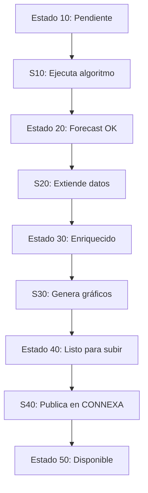

# 🧠 Sistema de Pronóstico de Demanda – Zeetrex

## 🎯 Objetivo General

El sistema desarrollado tiene como propósito generar pronósticos de demanda para productos en sucursales de retail, utilizando diferentes algoritmos de predicción, enriqueciendo los resultados con información relevante y consolidándolos para su publicación y uso operativo en la plataforma **CONNEXA**.

El proceso está completamente automatizado y se ejecuta por etapas, donde cada etapa es manejada por un **módulo independiente** que trabaja sobre un subconjunto de ejecuciones filtradas por **estado de avance**. Este diseño modular permite:

- 🔁 Paralelización de procesos
- 🔒 Control transaccional y coherencia entre etapas
- 🔄 Reanudabilidad del proceso en caso de fallos
- 🔍 Trazabilidad y depuración granular

---

## 🧩 Arquitectura Modular

El sistema está compuesto por los siguientes módulos programados en Python:

| Módulo         | Estado Inicial | Estado Final | Descripción |
|----------------|----------------|--------------|-------------|
| `S10_GENERAR_FORECAST_Planificado.py` | 10 | 20 | Ejecuta el algoritmo de pronóstico según parámetros y proveedor |
| `S20_GENERA_Forecast_Extendido.py`    | 20 | 30 | Enlaza productos y sucursales con IDs de CONNEXA y estadísticas complementarias |
| `S30_GENERA_Grafico_Detalle.py`       | 30 | 40 | Genera gráficos en base64 por artículo/sucursal |
| `S40_SUBIR_Forecast_Connexa.py`       | 40 | 50 | Publica resultados extendidos y graficados en CONNEXA, incluyendo métricas agregadas |

Cada módulo procesa **únicamente** las ejecuciones que se encuentran en su estado correspondiente, de modo que múltiples módulos pueden ejecutarse de forma paralela sin riesgo de superposición.

---

## 📊 Estados del Proceso

El avance de cada ejecución está marcado por su `supply_forecast_execution_status_id`, que evoluciona de forma secuencial:

| Estado | Significado                                      |
|--------|--------------------------------------------------|
| 10     | Forecast planificado, pendiente de ejecución     |
| 15     | En ejecución                                     |
| 20     | Forecast calculado                               |
| 30     | Forecast enriquecido con datos extendidos        |
| 35     | En proceso de graficación                        |
| 40     | Forecast listo para ser publicado en CONNEXA     |
| 45     | En proceso de publicación                        |
| 50     | Forecast publicado y disponible en CONNEXA       |

---

## 🔄 Flujo de Datos



---

## 🖥 Instalación del sistema

1. Instalar Python ≥ 3.8
2. Crear entorno virtual:
   ```bash
   python -m venv venv
   source venv/bin/activate  # en Linux/Mac
   venv\Scripts\activate   # en Windows
   ```
3. Instalar dependencias:
   ```bash
   pip install -r requirements.txt
   ```
4. Crear archivo `.env` con las credenciales y rutas necesarias:
   ```ini
   BASE3=...
   USUARIO3=...
   CONTRASENA3=...
   FOLDER_DATOS=...
   ```

---

## ⏱ Programación y Automatización

Se recomienda usar **.bat files** o **tareas programadas de Windows/Linux (cron jobs)** para ejecutar los módulos con frecuencia deseada:

Ejemplo `.bat` para Windows:
```bat
@echo off
cd E:\PY\DEMANDA
call venv\Scripts\activate
python S10_GENERAR_FORECAST_Planificado.py
```

Ejemplo `cron` para Linux:
```cron
0 5 * * * /home/usuario/.venv/bin/python /home/usuario/proyecto/S10_GENERAR_FORECAST_Planificado.py
```

Idealmente, cada proceso puede ejecutarse en hilos independientes o servidores distintos, procesando en paralelo los estados 10, 20, 30 y 40 sin interferencia.

---

## 📌 Ventajas del diseño

- ✅ Modular y extensible
- 🔄 Reintentable: puede reanudarse desde cualquier etapa
- ⚡ Paralelizable: cada etapa se puede ejecutar en paralelo o asincrónicamente
- 🔒 Robustez frente a errores intermedios
- 📈 Métricas agregadas para tableros de control

---

## 📘 Documentación Relacionada

- [S10_GENERAR_FORECAST_Planificado.md](./S10_GENERAR_FORECAST_Planificado.md)
- [S20_GENERA_Forecast_Extendido.md](./S20_GENERA_Forecast_Extendido.md)
- [S30_GENERA_Grafico_Detalle.md](./S30_GENERA_Grafico_Detalle.md)
- [S40_SUBIR_Forecast_Connexa.md](./S40_SUBIR_Forecast_Connexa.md)
- [funciones_forecast.md](./funciones_forecast.md)

---

## ✍️ Autoría

- **Diseño e implementación:** EWE - Zeetrex  
- **Última actualización:** 2025-03-22